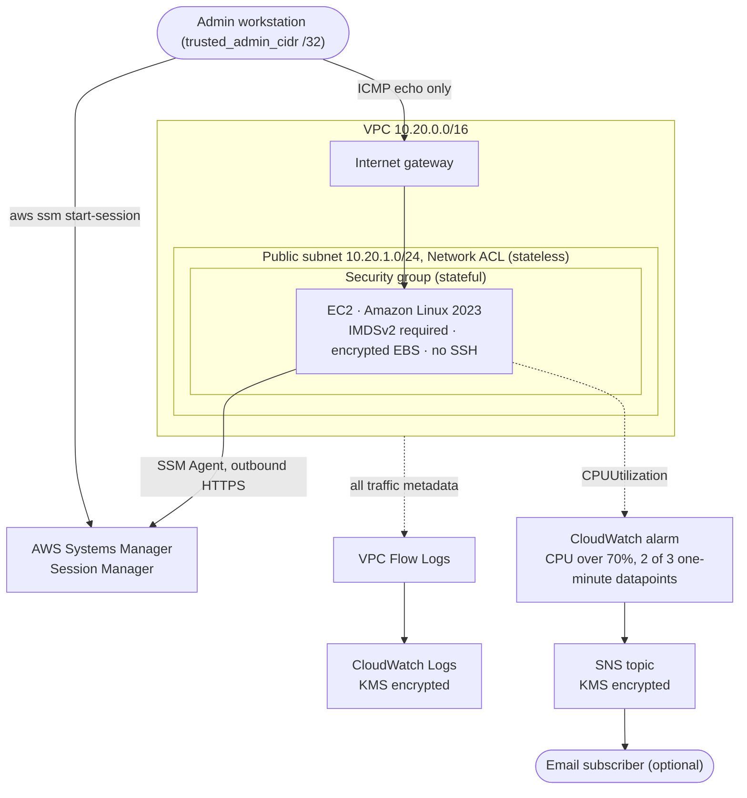

# AWS EC2 Network Security Lab

Terraform builds a small EC2 environment with layered network controls (Security Groups, Network ACLs, IMDSv2, VPC Flow Logs, CloudWatch and SNS). CI checks it for misconfiguration.


[](https://github.com/VijaysinghPuwar/Configuring-Cloud-Security-in-Amazon-Web-Services/actions/workflows/terraform-security.yml)


## Overview

The project began as a console-built course lab in 2025. Reviewing that lab turned up a NACL rule that never blocked anything, SSH open to the internet, and a CPU alarm that could never fire. I rebuilt the lab as code with those problems fixed:

- **No inbound management port.** The instance is administered through Systems Manager Session Manager, so it has no SSH rule and no key pair.
- **Two filtering layers with different semantics.** A stateful security group on the instance and a stateless network ACL on the subnet. A Terraform variable switches the NACL between allow and deny so you can watch the difference.
- **Evidence of what the network did.** VPC Flow Logs record ACCEPT and REJECT for every flow in the VPC.
- **Checked before deploy.** `terraform test`, TFLint and Checkov run on every push. None of them need AWS credentials.

## Architecture



## Security Controls

### Security group (stateful, instance level)

| Direction | Protocol | Port / type | Peer | Purpose |
|---|---|---|---|---|
| Inbound | ICMP | type 8 (echo request) | `trusted_admin_cidr` | Reachability test from one admin IP |
| Outbound | TCP | 443 | `0.0.0.0/0` | SSM Agent and package repositories |
| Outbound | ICMP | type 8 (echo request) | `0.0.0.0/0` | Outbound connectivity test |

There is no TCP or UDP ingress at all. Replies to allowed traffic pass automatically because the security group tracks connection state. The VPC's default security group is taken over by Terraform and left with no rules.

### Network ACL (stateless, subnet level)

| Dir | Rule | Action | Protocol | Port / type | Peer |
|---|---|---|---|---|---|
| In | 90 | **Deny** | ICMP | all | admin CIDR or `0.0.0.0/0`, only in `deny_*` modes |
| In | 100 | Allow | ICMP | type 8 | `trusted_admin_cidr` |
| In | 110 | Allow | ICMP | type 0 (echo reply) | `0.0.0.0/0` |
| In | 120 | Allow | TCP | 32768-65535 | `0.0.0.0/0` (replies to outbound HTTPS) |
| Out | 100 | Allow | TCP | 443 | `0.0.0.0/0` |
| Out | 110 | Allow | ICMP | type 8 | `0.0.0.0/0` |
| Out | 120 | Allow | ICMP | type 0 | `trusted_admin_cidr` |
| Both | `*` | Deny | all | all | `0.0.0.0/0` |

Rules are evaluated from the lowest number upward and **evaluation stops at the first match**. The deny is rule 90 so that it is evaluated before the allows at 100 and 110. Because the NACL keeps no state, every reply needs its own rule in the opposite direction. That is why rules In 110, In 120 and Out 120 exist.

The inbound ephemeral range starts at 32768, which covers Amazon Linux's client port range (32768-60999) and keeps 22 and 3389 out of the allowed range.

### IMDSv2

`http_tokens = "required"` rejects any metadata request without a session token, and `http_put_response_hop_limit = 1` stops a token from being obtained from a container or forwarded hop. An SSRF bug that can make the instance send a simple GET can no longer read the instance role's temporary credentials from `169.254.169.254`. Getting a token first needs a PUT with a custom header, which most SSRF primitives cannot send.

### VPC Flow Logs

All traffic (`ACCEPT` and `REJECT`) for the VPC goes to a KMS-encrypted CloudWatch Logs group at 1-minute aggregation. The delivery role can write only to that log group, and its trust policy is pinned to this account's flow logs (`aws:SourceAccount`, `aws:SourceArn`). [docs/validation.md](docs/validation.md#7-vpc-flow-logs) explains how to read `srcaddr`, `dstaddr`, `srcport`, `dstport`, `protocol` (1 = ICMP) and `action`.

### CloudWatch alarm and SNS

`CPUUtilization > 70` percent for 2 of 3 datapoints. With detailed monitoring those are 1-minute datapoints, so a sustained spike alarms in about two minutes and a single noisy sample does not. The alarm notifies an SNS topic on both ALARM and OK. The topic is encrypted with a customer managed KMS key. The AWS managed `aws/sns` key cannot be used here because its key policy cannot grant CloudWatch permission to publish.

## What I Tested

| Test | Expected | Result | Evidence |
|---|---|---|---|
| `terraform fmt -check`, `validate` | Clean | **Pass** (local, CI) | CI |
| `terraform test`: 10 plan-time assertions, mocked provider | All pass | **Pass** (local, CI) | [tests](terraform/tests/security_controls.tftest.hcl) |
| Mutation check: deny moved to rule 130, IMDS set to optional | Tests fail | **Pass**: 3 runs failed as expected (local) | Not committed |
| TFLint with AWS ruleset | No issues | **Pass** (local, CI) | CI |
| Checkov | No unresolved findings | **Pass**: 121 passed, 0 failed, 7 documented skips | CI |
| Session Manager login, port 22 closed | Shell opens, `nc` times out | Not yet validated in live AWS | [runbook](docs/validation.md#1-management-path-session-manager-only) |
| ICMP from admin, `allow` | Replies | Not yet validated in live AWS | [runbook](docs/validation.md#2-icmp-from-the-admin-machine-nacl_icmp_mode--allow) |
| ICMP from admin, `deny_admin` | Timeout, REJECT in flow logs | Not yet validated in live AWS | [runbook](docs/validation.md#3-nacl-deny-for-the-admin-cidr-deny_admin) |
| Outbound ping, `deny_all` | Fails: replies dropped by stateless NACL | Not yet validated in live AWS | [runbook](docs/validation.md#4-stateless-side-effect-deny_all) |
| IMDSv1 request | HTTP 401 | Not yet validated in live AWS | [runbook](docs/validation.md#6-imdsv2-enforcement) |
| CPU load | Alarm goes to ALARM | Not yet validated in live AWS | [runbook](docs/validation.md#8-cpu-alarm-and-sns) |
| SNS email | Notification received | Not yet validated in live AWS | [runbook](docs/validation.md#8-cpu-alarm-and-sns) |

The static checks show that the code defines the intended controls. They do not show that AWS enforces them. The live rows stay "Not yet validated" until they have been run and screenshotted.

## Troubleshooting and Lessons Learned

These come from the original console lab. The screenshots and full corrections are in [docs/original-lab.md](docs/original-lab.md).

- **NACL rule order.** I added rule 51 intending to deny ICMP, but saved it as *All traffic / Allow* ([screenshot](screenshots/2025-console-lab/07-nacl-rule-51-allow-misconfiguration.png)). Rule 1 already allowed everything anyway, and evaluation stops at the first match, so a deny there could never have taken effect. Pings kept working. The rebuild puts the deny at 90, below every allow, and a test fails if that order changes.
- **Stateless means replies too.** The old report said outbound pings would still work after an inbound ICMP deny. On a NACL they would not: the echo reply is new inbound traffic and hits the deny. `deny_all` mode exists to show this.
- **Self-ping of a public IP.** The old report blamed an AWS limitation. The self-ping failed while the security group allowed only SSH and worked once inbound ICMP was allowed ([before](screenshots/2025-console-lab/03-self-ping-public-ip-blocked-by-sg.png), [after](screenshots/2025-console-lab/05-self-ping-public-ip-allowed.png)). The returning packet carries the public IP as its source, so it is filtered like any other sender.
- **An alarm that cannot fire.** The threshold was `CPUUtilization > 10000` on a percentage metric ([screenshot](screenshots/2025-console-lab/10-cloudwatch-alarm-original-10000-threshold.png)). Variable validation now rejects values above 100.
- **Detailed monitoring is not the CloudWatch agent.** Detailed monitoring changes EC2 metric resolution from 5 minutes to 1 minute. The agent is separate software for OS-level metrics and was never installed.

## Repository Structure

```text
.
├── .github/workflows/terraform-security.yml   fmt, validate, test, TFLint, Checkov
├── docs/
│   ├── assets/banner.svg
│   ├── original-lab.md                         2025 console lab, corrections
│   └── validation.md                           live AWS test runbook
├── screenshots/2025-console-lab/               11 redacted screenshots from the original lab
└── terraform/
    ├── versions.tf  providers.tf  variables.tf  outputs.tf
    ├── network.tf  security.tf  compute.tf  monitoring.tf
    ├── tests/security_controls.tftest.hcl
    ├── terraform.tfvars.example
    └── README.md                               inputs, outputs, Checkov skips
```

## Deploy

Requires Terraform 1.6+, AWS credentials for a sandbox account, and the AWS CLI with the Session Manager plugin.

```bash
cd terraform
cp terraform.tfvars.example terraform.tfvars   # set trusted_admin_cidr to "$(curl -s https://checkip.amazonaws.com)/32"
terraform init
terraform fmt -check
terraform validate
terraform plan
terraform apply
```

## Validate

```bash
$(terraform output -raw ssm_session_command)            # shell via Session Manager
ping -c 4 "$(terraform output -raw instance_public_ip)"  # from the admin machine
terraform apply -var 'nacl_icmp_mode=deny_admin'         # then ping again and check flow logs
```

[docs/validation.md](docs/validation.md) has the full sequence: IMDSv2 checks, flow log queries, alarm testing and cleanup checks.

## Destroy

```bash
terraform destroy
```

The KMS key enters AWS's 7-day pending-deletion window. Everything else is removed immediately.

## Tools

Terraform · AWS provider 6.x · `terraform test` · TFLint (AWS ruleset) · Checkov · GitHub Actions · AWS CLI · Session Manager

## Cost and Cleanup

While running in us-east-1 this costs roughly two US cents per hour: a t3.micro, a public IPv4 address, detailed monitoring, 8 GiB gp3, one KMS key and one alarm. Flow log volume for a single idle instance is negligible. Check current prices before deploying, run `terraform destroy` when finished, and use the cleanup checks in [docs/validation.md](docs/validation.md#9-destroy-and-confirm-cleanup) to confirm nothing is left.
